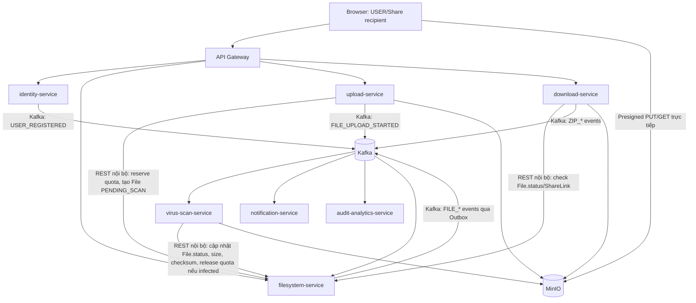

# File Storage Service — 01. Kiến trúc Microservices (v2.0)
> Thay thế "02-architecture-ver1.0" (modular monolith). Xem `00-scope-mvp-vs-stretch-ver2_0.md` cho phạm vi.

## 1. Danh sách service

| Service | Vai trò | Database riêng | Kiểu |
|---|---|---|---|
| `api-gateway` | Routing, xác thực JWT tại edge, rate limit auth endpoint | — (stateless, dùng Redis cho rate limit) | Sync entrypoint |
| `identity-service` | Đăng ký/login/refresh/logout/quên-đổi mật khẩu/profile | `identity_db` (Postgres) | REST |
| `filesystem-service` | **Nguồn sự thật duy nhất** cho File/Folder/Trash/Quota/ShareLink; expose API nội bộ cho các service khác | `filesystem_db` (Postgres) | REST (public + internal) |
| `upload-service` | Điều phối upload (single + multipart), sinh presigned PUT URL | `upload_db` (Postgres) | REST |
| `download-service` | Presigned GET URL, ZIP job + Archive Worker (gộp) | `download_db` (Postgres) | REST + Kafka consumer |
| `virus-scan-service` | Consumer duy nhất quyết định file an toàn; **tính checksum thật trong cùng lượt quét** | Redis (event dedupe), không cần DB quan hệ riêng | Kafka consumer, stateless |
| `notification-service` | Lưu thông báo cho user, gửi email (MailHog local) | `notification_db` (Postgres) | Kafka consumer |
| `audit-analytics-service` | Audit log + thống kê cơ bản | `audit_analytics_db` (Postgres) | Kafka consumer + REST (read) |

**Nguyên tắc**: `filesystem-service` là service duy nhất được ghi vào bảng `File`/`Folder`/`ShareLink`/`StorageQuota`. Mọi service khác (upload, download, virus-scan) muốn thay đổi trạng thái file/quota đều gọi API nội bộ của `filesystem-service`, không tự ý ghi trực tiếp — đây là ranh giới bounded context quan trọng nhất của toàn hệ thống.

## 2. Sơ đồ tổng quan



Ghi chú luồng: `USER_REGISTERED` do `identity-service` phát, `filesystem-service` consume để tạo root folder + quota — đây là ví dụ saga bất đồng bộ giữa 2 service, thay vì 1 transaction.

## 3. Luồng Single-file Upload (MỚI — tách riêng khỏi multipart)

File nhỏ hơn `multipart_threshold` (mặc định 100MB, cấu hình yml) dùng luồng đơn giản hơn nhiều so với multipart — không cần `ListParts`, không cần endpoint `/complete` do client gọi.

1. **Client → `upload-service`**: `POST /uploads` với `{parentFolderId, name, size, mimeType}`. `upload-service` validate MIME allowlist.
2. **`upload-service` → `filesystem-service`** (REST nội bộ, đồng bộ): `POST /internal/files` — filesystem-service kiểm tra quota còn đủ không (atomic conditional update `StorageQuota.current_usage`), nếu đủ thì tạo `File` với `status=PENDING_SCAN` và trả về `fileId`. Nếu không đủ quota → trả lỗi, `upload-service` trả `507 QUOTA_EXCEEDED` cho client, không tạo gì thêm.
3. **`upload-service`** sinh `storage_key` (UUID, opaque), gọi MinIO SDK tạo 1 presigned PUT URL (TTL 5 phút, single object, không multipart). Trả về client `{fileId, uploadUrl, expiresAt}`.
4. **Client PUT** binary trực tiếp lên MinIO bằng `uploadUrl` — 1 request duy nhất, không chia part.
5. **Client → `upload-service`**: `POST /uploads/{fileId}/confirm` (gọi ngay sau khi PUT xong, để UX phản hồi nhanh thay vì chờ MinIO event).
6. **`upload-service`** gọi MinIO `statObject(storage_key)` để lấy **size và ETag thật** từ MinIO (không tin số `size` client khai lúc bước 1) — đây là chỗ fix vấn đề size-mismatch (xem mục 5.3). So sánh với size đã khai:
   - Nếu size thật ≤ size đã reserve quota → OK, tiếp tục.
   - Nếu size thật > size đã reserve (client khai gian) → `upload-service` gọi `filesystem-service` để **xóa File placeholder + release quota đã reserve**, xóa luôn object vừa upload trên MinIO, trả lỗi `409 SIZE_MISMATCH`.
7. **`upload-service` → `filesystem-service`** (REST nội bộ): cập nhật `File.size` = size thật lấy từ MinIO (ghi đè số client khai ban đầu).
8. **`upload-service`** publish Kafka event `FILE_UPLOAD_STORED {fileId, ownerId, storageKey, size}` (qua Outbox của chính nó, hoặc gọi `filesystem-service` publish hộ — MVP chọn cách đơn giản: `upload-service` tự publish, không cần Outbox riêng vì không có DB write cần đồng bộ với event này ở bước cuối).
9. **`virus-scan-service`** nhận `FILE_UPLOAD_STORED` → xử lý theo mục 5 (chung với multipart).

Sự khác biệt cốt lõi so với multipart: **không có bước `CompleteMultipartUpload`**, và việc "xác nhận upload xong" dựa vào client gọi `/confirm` (đồng bộ, nhanh cho UX) thay vì chờ MinIO bucket notification (bất đồng bộ, có độ trễ). MVP dùng `/confirm` làm nguồn xác nhận chính; MinIO `ObjectCreated` notification (nếu bật ở Stretch) chỉ dùng để đối soát/phát hiện trường hợp client bỏ ngang không gọi `/confirm`.

## 4. Luồng Multipart Upload (file ≥ threshold, resumable)

1–2. Giống single-file: `upload-service` validate + gọi `filesystem-service` reserve quota + tạo `File(PENDING_SCAN)`.
3. `upload-service` gọi MinIO `InitiateMultipartUpload`, lưu `minio_upload_id` vào `UploadSession` (DB riêng của `upload-service`), cấp presigned URL cho từng part (TTL 5 phút/part).
4. Client PUT từng part trực tiếp MinIO; resume gọi `GET /uploads/{id}` → `upload-service` gọi MinIO `ListParts` để biết part nào đã có, chỉ cấp lại URL cho part thiếu.
5. Client gọi `POST /uploads/{id}/complete` với danh sách `{partNumber, etag}`.
6. `upload-service` gọi MinIO `CompleteMultipartUpload`, sau đó gọi `ListParts`/`statObject` lấy **tổng size thật** (không dùng `ETag` tổng của multipart làm checksum — ETag multipart không phải hash thật, chỉ dùng để xác nhận đủ part).
7. Giống bước 6–8 ở single-file: so khớp size thật với quota đã reserve, cập nhật `File.size`, publish `FILE_UPLOAD_STORED`.
8. `UploadSession.status = COMPLETED`.

Upload bị bỏ dở quá `upload_session_ttl` (mặc định 24h, cấu hình yml): scheduler trong `upload-service` tự `AbortMultipartUpload` trên MinIO **và** gọi `filesystem-service` release quota + xóa `File` placeholder — cả hai bước phải cùng thành công hoặc retry, tránh rò rỉ storage/quota (đã có ở v1.0, giữ nguyên).

## 5. Virus Scan Service — nơi giải quyết cả 3 vấn đề đã nêu ở review trước

`virus-scan-service` là consumer duy nhất của `FILE_UPLOAD_STORED`. Vì service này **buộc phải đọc toàn bộ object từ MinIO để chạy ClamAV**, đây chính là chỗ tự nhiên nhất để làm luôn 2 việc khác đang tốn "một lượt đọc" tương tự — thay vì mỗi việc đọc object riêng.

### 5.1 Fix vấn đề #1 — checksum không cần đọc lại object riêng
Trước đây (v1.0) `upload-service`/control plane phải tự đọc lại object để tính SHA-256 tại bước `/complete`, mâu thuẫn với nguyên tắc "backend không tải bandwidth file lớn". **v2.0 bỏ hẳn bước xác minh checksum đồng bộ ở `upload-service`.** Thay vào đó:
- `virus-scan-service` stream object từ MinIO **một lần duy nhất**, vừa chạy ClamAV vừa tính SHA-256 trên cùng stream (dùng `DigestInputStream` bọc quanh input stream đưa vào ClamAV client — không đọc 2 lần).
- Sau khi scan xong, gọi `filesystem-service` cập nhật `File.checksum` = giá trị tính được (nguồn sự thật duy nhất, không phải giá trị client tự khai).
- Nếu client có gửi checksum lúc khởi tạo upload (optional hint), `virus-scan-service` so sánh và log cảnh báo nếu lệch, nhưng **không chặn** (vì đây chỉ là gợi ý phát hiện lỗi truyền tải sớm, không phải cơ chế bảo mật chính — virus scan mới là gate bảo mật).

### 5.2 Fix vấn đề #2 — quota bị rò rỉ khi file nhiễm virus
`virus-scan-service`, khi phát hiện nhiễm độc, PHẢI gọi `filesystem-service` **API nội bộ duy nhất** xử lý cả 2 việc trong 1 lời gọi (tránh quên 1 trong 2 như lỗi ở v1.0):
```
POST /internal/files/{fileId}/reject
body: {reason: "INFECTED", signature: string}
```
`filesystem-service` xử lý trong 1 transaction DB: xóa `File` row, **release `reserved_size` khỏi `StorageQuota.current_usage`**, ghi `TrashItem` (không — file nhiễm độc không vào Trash, xóa hẳn), rồi publish `FILE_INFECTED` + `FILE_DELETED` qua Outbox. Vì quota-release nằm chung transaction với việc xóa file, không thể xảy ra tình trạng "xóa file nhưng quên trả quota" nữa.

### 5.3 Fix vấn đề #3 — size khai báo sai lệch với size thật
Đã xử lý ở bước 6 (single) / bước 6-7 (multipart) tại `upload-service`: **luôn lấy size thật từ MinIO (`statObject` hoặc tổng `ListParts`) làm giá trị cuối cùng**, không bao giờ tin số client khai ở bước khởi tạo. Nếu số client khai nhỏ hơn thật tế (để "né" quota check ban đầu), hệ thống phát hiện ngay tại bước confirm/complete và từ chối trước khi file kịp chuyển sang `PENDING_SCAN` được xử lý tiếp — không đợi đến virus scan mới phát hiện.

### 5.4 Luồng đầy đủ trong Virus Scan Service
```
1. Consume FILE_UPLOAD_STORED {fileId, storageKey, size}
2. Stream object từ MinIO qua DigestInputStream (SHA-256) → ClamAV client
3a. Sạch:
    POST /internal/files/{fileId}/activate {checksum: <sha256>}
    filesystem-service: transition PENDING_SCAN → ACTIVE, lưu checksum, publish FILE_UPLOAD_COMPLETED
3b. Nhiễm độc:
    POST /internal/files/{fileId}/reject {reason: "INFECTED"}
    filesystem-service: xóa File, release quota (1 transaction), publish FILE_INFECTED + FILE_DELETED
    virus-scan-service: xóa object trên MinIO
4. Ack Kafka message (offset commit) chỉ sau khi bước 3a/3b thành công — nếu filesystem-service
   không phản hồi, không ack, để Kafka redeliver (idempotent nhờ check File.status hiện tại trước khi transition).
```

## 6. Luồng Download (không đổi nhiều so với v1.0, cập nhật cho microservices)
1. Client → `download-service`: xin download URL cho file/share.
2. `download-service` gọi `filesystem-service` (REST nội bộ, đồng bộ) để xác thực owner/share permission + `File.status == ACTIVE`.
3. Nếu hợp lệ, `download-service` sinh presigned GET URL (5 phút), publish `FILE_DOWNLOAD_REQUESTED` (Kafka, cho `audit-analytics-service`).
4. Client GET trực tiếp MinIO, hỗ trợ HTTP Range để resume.
5. *(Stretch)* MinIO bucket notification xác nhận `FILE_DOWNLOAD_CONFIRMED`.

## 7. Luồng ZIP folder (trong `download-service`, gộp vai trò Archive Worker)
1. `download-service` tạo `ZipJob(PENDING)`, publish `ZIP_REQUESTED`.
2. Chính `download-service` (hoặc 1 consumer thread trong cùng service — MVP không tách container riêng cho Archive để giảm số lượng service phải deploy) nhận lại `ZIP_REQUESTED`, gọi `filesystem-service` lấy danh sách file `ACTIVE` trong folder, stream từng object từ MinIO vào ZIP, ghi kết quả lên MinIO.
3. `ZipJob.status = READY`, publish `ZIP_READY` cho `notification-service`.

## 8. Luồng Share access (giữ logic v1.0, chủ sở hữu là `filesystem-service`)
1. `GET /shares/{token}` → `filesystem-service` tra `ShareLink`, resolve **ancestor gần nhất active** bằng cách đi ngược `parent_id` (không còn cần lo về "override merge" vì đã bỏ merge — logic đơn giản hơn v1.0).
2. PRIVATE: kiểm tra password; sai quá `share_password_max_attempts` (mặc định 5) trong 15 phút → khóa theo cặp `(shareId, IP+UA hash)` lưu Redis TTL 15 phút (giữ nguyên quyết định IP/fingerprint đã chốt).
3. Trash luôn bị loại khỏi kết quả resolve, dù ancestor còn active (giữ BR-024 gốc).
4. VIEW/EDIT áp dụng cho thao tác; EDIT tạo file mới vẫn gán `owner_id`/quota theo chủ sở hữu gốc (giữ BR-025 gốc), không phải người truy cập share.

## 9. Đăng ký user + provisioning root folder (ví dụ Saga đơn giản)
1. `identity-service`: tạo `User` trong `identity_db`, publish `USER_REGISTERED {userId, email}`.
2. `filesystem-service` consume, tạo `Folder(root, parent_id=NULL)` + `StorageQuota(quota=10GB)` trong `filesystem_db` — 1 transaction cục bộ trong chính service này.
3. Nếu bước 2 lỗi/chưa xử lý kịp, API filesystem trả `404 ROOT_NOT_PROVISIONED_YET` cho tới khi consumer xử lý xong (thường vài trăm ms) — client có thể retry ngắn hoặc hiển thị loading. Đây là **eventual consistency** thực sự giữa 2 service, khác hẳn cách v1.0 làm trong 1 transaction vì trước đó là monolith.

## 10. Giao tiếp nội bộ (service-to-service)
- Đồng bộ (REST, luôn có timeout + retry ngắn): `upload-service`/`download-service`/`virus-scan-service` → `filesystem-service`, vì cần tính nhất quán mạnh cho quota và trạng thái file (không thể để 2 upload cùng lúc oversell quota nếu chỉ dựa vào eventual consistency).
- Bất đồng bộ (Kafka): mọi thứ còn lại — notification, audit, analytics, kích hoạt virus scan, ZIP trigger, provisioning root folder.
- Xác thực nội bộ: mỗi service có 1 `internal-service-secret` dùng chung (header `X-Internal-Token`), kiểm tra ở tầng filter trước khi vào controller `/internal/**`; endpoint `/internal/**` không lộ ra ngoài qua `api-gateway` (gateway chỉ route path public).

## 11. Replica & Load Balancing cho `filesystem-service` (MỚI — ADR-116, giải quyết R-201)
`filesystem-service` là service duy nhất mọi service khác đều phụ thuộc (upload/download/virus-scan đều gọi REST nội bộ tới nó), nên nếu chỉ chạy 1 instance, nó chết là cả hệ thống ngưng — dù bản thân kiến trúc service-tách-biệt không có lỗi gì.

**Giải pháp: chạy nhiều replica cùng 1 image `filesystem-service`, đặt sau load balancer**, thay vì tách nhỏ service đó ra (việc tách sẽ đánh mất transaction atomic đã chốt ở ADR-105 và ADR-102, buộc phải làm Saga — không cần thiết nếu mục tiêu chỉ là chịu lỗi khi 1 instance down).

- **Local/Docker Compose**: dùng `docker compose up --scale filesystem-service=3`, đặt Nginx (hoặc Traefik) làm reverse proxy đơn giản phía trước 3 instance này, round-robin theo default. Các service khác (`upload-service`, `download-service`, `virus-scan-service`) gọi tới hostname của Nginx (`http://filesystem-lb:8080`) thay vì gọi thẳng `http://filesystem-service:8080`.
- **`filesystem-service` phải stateless ở tầng ứng dụng** để chạy nhiều instance an toàn — trạng thái (File/Folder/Quota/ShareLink) chỉ nằm trong `filesystem_db` (Postgres), không giữ gì trong bộ nhớ instance (không session sticky, không cache local không đồng bộ). Điều này vốn đã đúng theo thiết kế hiện tại, không cần sửa code, chỉ cần chạy nhiều container.
- **Quota reservation vẫn atomic đúng** dù có nhiều replica, vì atomic hóa nằm ở tầng Postgres (conditional update/row lock), không nằm ở tầng instance — nhiều replica cùng ghi vào 1 Postgres vẫn nhất quán bình thường.
- Các service còn lại (`upload-service`, `download-service`, `identity-service`...) **chưa cần multi-replica ở MVP** — chỉ `filesystem-service` được ưu tiên vì là điểm phụ thuộc nhiều nhất; có thể mở rộng sau nếu benchmark cho thấy cần (xem `08-risks` mục "Open items").

## 12. Truy vết
Mục 3–4 giải quyết yêu cầu "thêm luồng single-file upload". Mục 5 giải quyết cả 3 vấn đề đã nêu (checksum, quota leak khi infected, size mismatch) tại một điểm kiến trúc duy nhất. Mục 1–2, 9–10 thể hiện chuyển đổi sang microservices thật sự (database-per-service, sync/async communication, saga). Mục 11 giải quyết R-201 bằng replica thay vì tách nhỏ service, giữ nguyên các quyết định atomic ở ADR-102/105.
